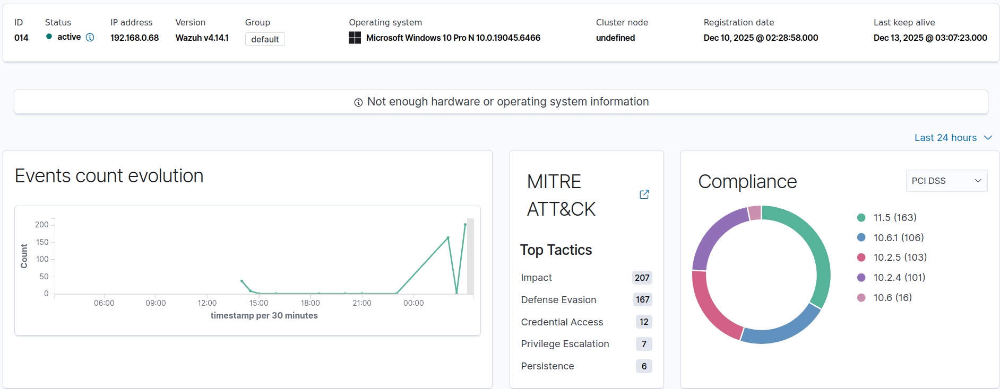

# Wazuh SOC Homelab - Detection Lab
**Hands-on SOC Detection & Response Lab with Wazuh**

A fully self-built Security Operations Center (SOC) homelab using Wazuh — an open-source SIEM and XDR platform. This project demonstrates end-to-end threat detection and response workflows in a realistic multi-OS environment, focusing on entry-level SOC analyst skills: log ingestion, alert triage, detection engineering, troubleshooting, and basic incident response.

  
*Wazuh Dashboard showing massive authentication failure spike during SSH brute-force simulation*

## Project Summary and Motivation

As an aspiring cybersecurity professional targeting junior SOC analyst roles, I created this lab to bridge the gap between theoretical knowledge (e.g., Microsoft SC-200/SC-300 coursework, Security+ certification) and hands-on experience that employers actually look for.

This homelab replicates real SOC workflows:
- Deploying and managing agents across Linux and Windows endpoints
- Ingesting and enriching logs
- Detecting attacks using stock and custom rules
- Triaging alerts in the dashboard
- Mapping to MITRE ATT&CK
- Simulating incident response actions

It highlights my ability to troubleshoot common production issues (agent connectivity, indexer performance, certificate errors) — skills directly transferable to tools like Wazuh, Splunk, Elastic, or Microsoft Sentinel.

Everything runs on **bare-metal personal hardware** (no VMs for the endpoints) to ensure authentic log behavior and network interactions.

**Contact**: John Gill | Security+ (SY0-701) | [LinkedIn](https://www.linkedin.com/in/jessemcgeejr)

## Lab Architecture

  
*Homelab network topology: Wazuh manager centralizing logs from Linux/Windows endpoints and monitored attacker machine*

## ⚙️ Setup Overview

This homelab runs entirely on **bare‑metal hardware** with one attacker system (also monitored as a Wazuh agent) and two additional endpoints. All systems report logs to a central Wazuh Manager for detection and visualization.

- **Wazuh Manager/Dashboard (Ubuntu 22.04)**  
  Installed using [Wazuh official guide](https://documentation.wazuh.com/current/installation-guide/index.html).  
  Configured to collect logs from Windows, Linux, and Parrot agents.  
  Provides dashboards, alerting, and MITRE ATT&CK mapping.

- **Windows 10 Agent ("Fistandantilus")**  
  Wazuh agent installed. Security Event logging enabled (Event ID 4625 for failed logons).  
  Used for RDP brute‑force and malware execution scenarios.  
  Demonstrates detection of credential access and execution techniques.

- **Linux Agent ("Raistlin")**  
  Wazuh agent installed. Auditd enabled for privilege escalation and FIM alerts.  
  Used for SSH brute‑force, privilege escalation, and file monitoring scenarios.  
  Demonstrates detection of privilege escalation and defense evasion techniques.

- **Parrot OS Attacker + Agent**  
  Dual role: generates safe attack traffic **and** reports its own logs to Wazuh.  
  Tools: Hydra, Nmap, Atomic Red Team, EICAR test file.  
  Used for brute‑force, port scanning, and malware simulation scenarios.  
  Demonstrates visibility into attacker activity as well as victim endpoints.

**Note:** This repo focuses on attack/detection labs. For installation details, see [Wazuh documentation](https://documentation.wazuh.com/current/installation-guide/index.html).

## Simulated Attacks & Detection Results

### 1. SSH Brute-Force Attack (Linux Endpoint)

**Attack Execution**  
- Tool: Metasploit `auxiliary/scanner/ssh/ssh_login`  
- Target: Username "Raistlin"  
- Password list: RockYou (first 500)  
- Result: 656 failed login attempts in seconds  

  
*Metasploit attack console*

**Detection**  
- Logs from `/var/log/auth.log` ingested successfully  
- Triggered Wazuh rule **57105** (multiple SSH authentication failures)  
- Alert level escalation based on volume  
- Mapped to MITRE ATT&CK **T1110.001** (Brute Force – Password Guessing)  

  
*Decoded alert JSON*  
  
*Raw failed login entries*

**Troubleshooting Overcome**: Initially no auth.log monitoring — added custom `<localfile>` entry in agent `ossec.conf` and restarted agent.

### 2. RDP Brute-Force Attack (Windows Endpoint)

**Attack Execution**  
- Tool: Hydra on Parrot OS  
- Target: Local "administrator" account  
- Password list: RockYou (first 100)  
- Result: 101 failed login attempts  

  
*Clear spike of 101 failures in dashboard*  
  
*Hydra execution from attacker IP*

**Detection**  
- Windows Event ID **4625** captured (enhanced with Sysmon)  
- Triggered Wazuh rule **18120** (multiple failed logons) → Level 10 alerts  
- Mapped to MITRE ATT&CK **T1110.003** (Brute Force – Password Spraying)  

  
*Active bare-metal Windows agent*  
  
*MITRE ATT&CK navigator view*  
  
*Decoded Event 4625 with attacker IP*

**Troubleshooting Overcome**: Alerts delayed due to indexer overload — cleared data directory, restarted services, and re-initialized security index.

## Lessons Learned & Real SOC Workflow Ties

- **Alert Triage**: Used dashboard filters (`level: >7 AND rule.description: *brute*`) to quickly prioritize real threats over noise — mirrors Tier 1 analyst shift workflow.  
- **False Positive Reduction**: Tested rule tuning ideas with `wazuh-logtest` and agent grouping to reduce heartbeat/alert fatigue.  
- **Incident Response Simulation**: Detection (seconds) → Triage (minutes) → Containment (block attacker IP via `iptables`). Documented findings in MITRE navigator export.  
- **Production Troubleshooting**: Resolved agent "Never connected" status (firewall/UDP 1514), certificate errors, and indexer performance issues — directly applicable to on-call scenarios.

## Demonstrated Skills

| Category               | Competencies Demonstrated                                      | Tools/Techniques                          | Real-World Application                  |
|------------------------|----------------------------------------------------------------|-------------------------------------------|----------------------------------------|
| Log Monitoring         | Multi-OS log ingestion, verification, enrichment               | Wazuh agents, Sysmon, ossec.conf          | Baseline monitoring in any SIEM        |
| Detection Engineering  | Analyzed stock rules, MITRE mapping, identified tuning paths   | Default rules, MITRE navigator            | Rule/signature development             |
| Alert Analysis         | Severity-based triage, JSON decoding, pivoting                 | Security Events UI, queries               | Incident investigation (Splunk, Sentinel) |
| Visualization          | Custom dashboard views, MITRE heatmaps, diagrams               | Wazuh Dashboard                           | Reporting to stakeholders              |
| Troubleshooting        | Agent connectivity, indexer lags, cert issues                  | systemctl, logs, certutil                 | On-call debugging in production         |
| Incident Response      | Simulated containment, documentation, timelines                | iptables, alert exports                   | Tier 1/2 IR playbooks                  |

This lab is 100% self-built on personal bare-metal hardware. All configs in `/configs/`, evidence in `/screenshots/`.

Fork, contribute, or open an issue with questions!

**Last updated: December 13, 2025**v
