# Wazuh SOC Detection Homelab

**Hands-on SIEM & XDR Lab – Junior SOC Analyst Portfolio**  
Self-built Wazuh-based Security Operations Center homelab demonstrating real-time threat detection, alert triage, and basic incident response across Linux and Windows endpoints — all on **bare-metal hardware** (no VMs for agents).

  
*Wazuh dashboard showing massive authentication failure spike during SSH brute-force simulation*

---

## Table of Contents
- [Project Summary & Motivation](#project-summary--motivation)
- [Lab Architecture](#lab-architecture)
- [Tools & Tech Stack](#tools--tech-stack)
- [Simulated Attacks & Detections](#simulated-attacks--detections)
  - [1. SSH Brute-Force (Linux Endpoint)](#1-ssh-brute-force-linux-endpoint)
  - [2. RDP Brute-Force (Windows Endpoint)](#2-rdp-brute-force-windows-endpoint)
  - [3. Network Reconnaissance – Nmap Port Scan (Linux Endpoint)](#3-network-reconnaissance--nmap-port-scan-linux-endpoint)
- [File Integrity Monitoring (FIM) – Windows & Linux](#file-integrity-monitoring-fim--windows--linux)
- [Privilege Escalation Scenarios (Linux & Windows)](#privilege-escalation-scenarios-linux--windows)
  - [Linux SSH Privilege Escalation (Raistlin)](#linux-ssh-privilege-escalation-raistlin)
  - [Windows WinRM Privilege Escalation (Fistandantilus)](#windows-winrm-privilege-escalation-fistandantilus)
- [Why This Lab Matters](#why-this-lab-matters)

---

## Project Summary & Motivation

As an aspiring cybersecurity professional targeting junior SOC analyst roles, I created this lab to bridge the gap between theoretical knowledge (Security+ certification) and hands-on skills employers value most: log ingestion, detection engineering, alert triage, MITRE ATT&CK mapping, and troubleshooting real-world issues.

**Key Outcomes**
- Detected **750+ authentication failures** across SSH & RDP brute-force attacks  
- Mapped to MITRE ATT&CK **T1110** (Brute Force)  
- Validated File Integrity Monitoring (FIM) and network reconnaissance detection  
- Everything runs on **bare-metal personal hardware** for authentic log behavior and network interactions  

**Contact** — John Gill | Security+ (SY0-701) | LinkedIn | Email

---

## Lab Architecture

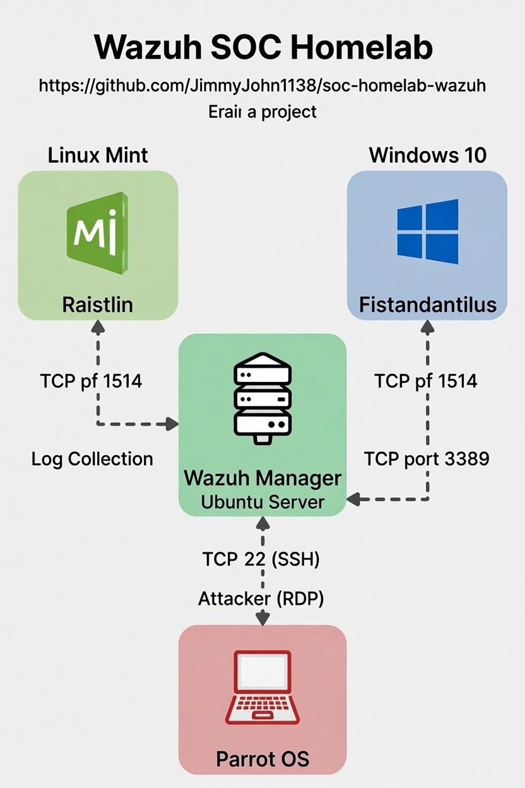

- **Manager/Dashboard:** Ubuntu 22.04  
- **Linux Agent:** Ubuntu/Mint ("Raistlin") — SSH brute-force, PrivEsc, Linux FIM  
- **Windows Agent:** Windows 10 ("Fistandantilus") — RDP brute-force, WinRM PrivEsc, registry FIM  
- **Attacker/Agent:** Parrot OS ("Takhisis") — Metasploit, Hydra, Nmap, Evil-WinRM  

---

## Tools & Tech Stack

- **SIEM/XDR:** Wazuh 4.x  
- **Network IDS:** Suricata (Emerging Threats ruleset)  
- **Attack Tools:** Metasploit, Hydra, Nmap, Evil-WinRM  
- **Logging:** Sysmon (Windows), auditd (Linux), Suricata EVE JSON  
- **Hardware:** Bare-metal dual-boot setup  

---

## Simulated Attacks & Detections

### 1. SSH Brute-Force (Linux Endpoint)

**Attack:** Metasploit `auxiliary/scanner/ssh/ssh_login`  
**Result:** 656 failed logins  
**Detection:** Rule 5710 / 57105 → MITRE **T1110.001**


*Dashboard showing 656 authentication failures in seconds*


*Metasploit console running the attack*


*Decoded auth.log event from attacker IP*

<details>
<summary><strong>Triage Workflow</strong></summary>

Confirm spike in authentication failures

Validate source IP

Check for successful logins

Correlate with other activity

Escalate if necessary

</details>

<details>
<summary><strong>Troubleshooting‑Driven Reproducibility</strong></summary>

Symptoms

Only rule 5710 fired

No correlation alerts

Sometimes no alerts at all

Root Causes

auth.log not monitored

Agent connectivity issues

Indexer queue lag

Fix Implemented

```xml
<localfile>
  <location>/var/log/auth.log</location>
  <log_format>syslog</log_format>
</localfile>
```
Validation

Re-ran attack

656 failures detected

Level‑10 brute-force alert fired

</details>

---

### 2. RDP Brute-Force (Windows Endpoint)

**Attack:** Hydra — 101 failed attempts  
**Detection:** Rule 60122 → Level 10 → MITRE **T1110**

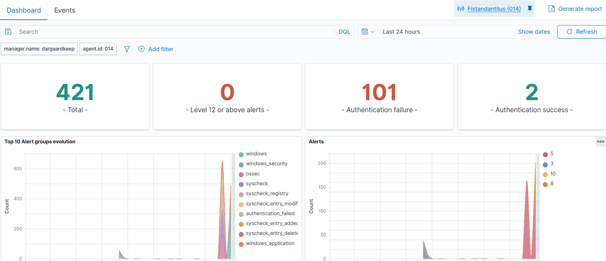
*101 authentication failures with clear spike*

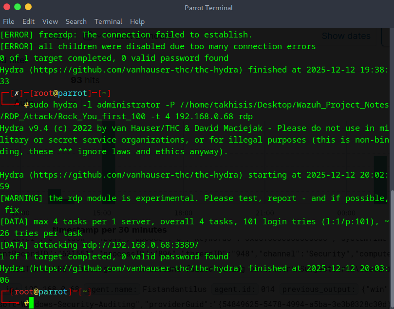
*Hydra confirming 101 attempts from 192.168.0.74*

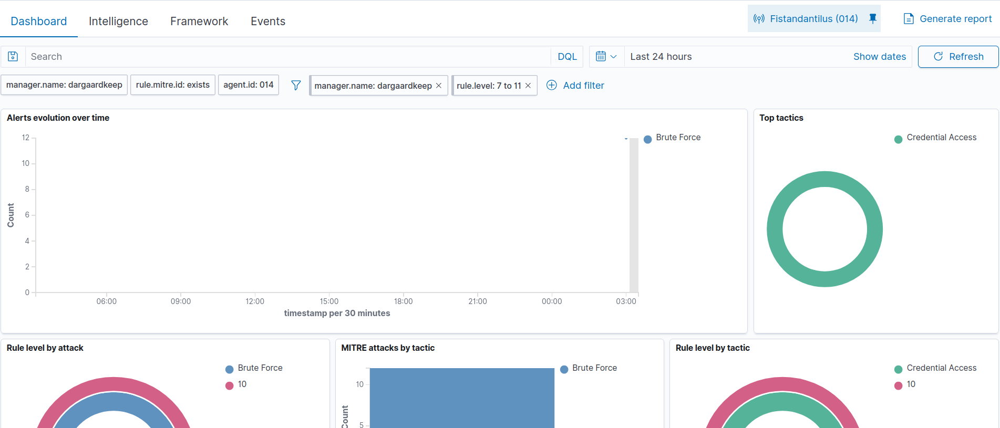
*Brute Force tactic and level 10 severity confirmed*

[RDP Event JSON](screenshots/rdp-event-json)
*Decoded Event 4625 showing failed logon details*

<details>
<summary><strong>Triage Workflow</strong></summary>

Confirm spike in failed logons

Validate source IP

Check for successful logons

Review logon type (10 = RDP)

Escalate if needed

</details>

<details>
<summary><strong>Troubleshooting‑Driven Reproducibility</strong></summary>

Symptoms

No 4625 logs

No brute-force alerts

Hydra activity not detected

Root Causes

Windows auditing disabled

EventChannel not monitored

Sysmon not forwarding logs

Fix Implemented

```xml
<localfile>
  <location>Security</location>
  <log_format>eventchannel</log_format>
</localfile>
```
Validation

101 failures detected

Rule 60122 fired

</details>

---

### 3. Network Reconnaissance – Nmap Port Scan (Linux Endpoint)

**Attack:** Nmap SYN scan  
**Detection:** Suricata ET SCAN → Wazuh ingestion  
**MITRE:** **T1595**, **T1046**

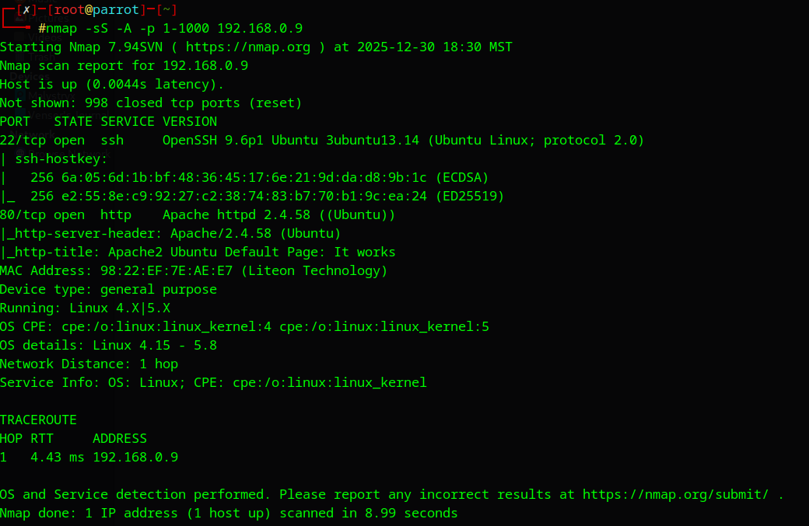
*Scan results showing open ports and services*


*Wazuh dashboard spike during reconnaissance activity*

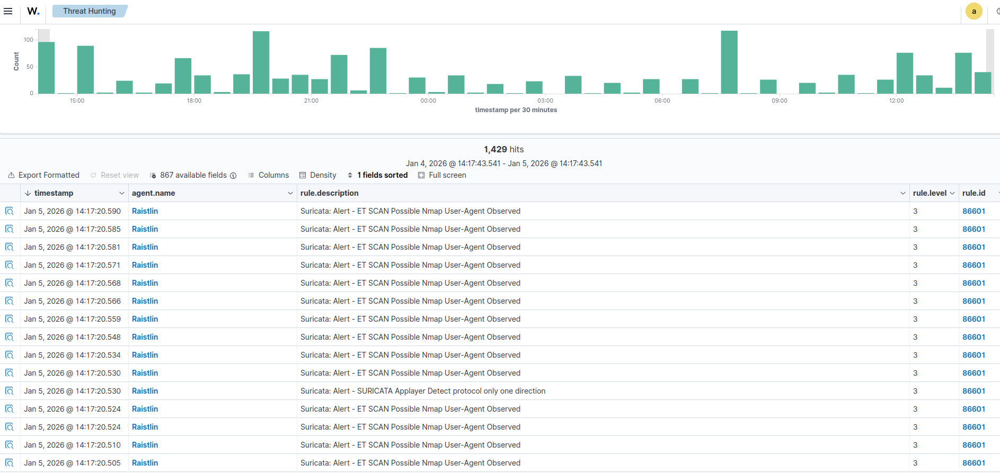
*Suricata Emerging Threats detection forwarded to Wazuh*

<details>
<summary><strong>Triage Workflow</strong></summary>

Confirm Suricata alert

Validate source IP

Identify scan type (SYN, OS detection, service discovery)

Check for follow‑on activity

Escalate if needed

</details>

<details>
<summary><strong>Troubleshooting‑Driven Reproducibility</strong></summary>

Symptoms

No Suricata alerts

eve.json  empty

Wazuh not ingesting IDS logs

Root Causes

Suricata disabled

EVE JSON output disabled

Wazuh not monitoring eve.json

Fix Implemented
```xml
<localfile>
  <location>/var/log/suricata/eve.json</location>
  <log_format>json</log_format>
</localfile>
```
Validation

Re-ran Nmap

Suricata → Wazuh alerts ingested

</details>

---

## File Integrity Monitoring (FIM) – Windows & Linux

### Windows File FIM – Lifecycle Test (Fistandantilus)

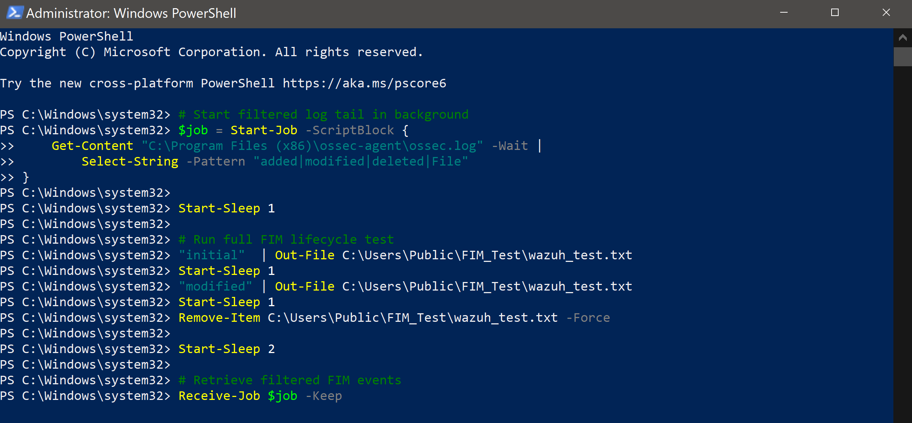
*Lifecycle: create → modify → delete events captured*

**MITRE:** **T1070.004**, **T1565.001**

---

### Windows Registry FIM – Fistandantilus

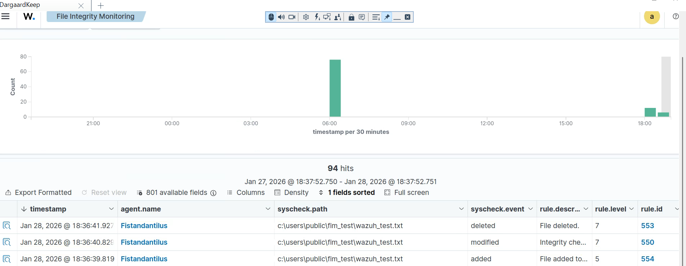

**Rules:** 752 / 751 / 750 / 594  
**MITRE:** **T1112**

<details>
<summary><strong>Triage Workflow</strong></summary>

Confirm file path

Validate user

Check lifecycle (add/modify/delete)

Correlate with other activity

</details>

<details>
<summary><strong>Troubleshooting‑Driven Reproducibility</strong></summary>

Symptoms

No file alerts

Agent startup failures

Syscheck not loading

Root Causes

Invalid XML

Missing Syscheck paths

Indexer lag

Fix Implemented<details>
<summary><strong>Triage Workflow</strong></summary>

Confirm file path

Validate user

Check lifecycle (add/modify/delete)

Correlate with other activity

</details>

<details>
<summary><strong>Troubleshooting‑Driven Reproducibility</strong></summary>

Symptoms

No file alerts

Agent startup failures

Syscheck not loading

Root Causes

Invalid XML

Missing Syscheck paths

Indexer lag

Fix Implemented
```xml
<syscheck>
  <directories check_all="yes">C:\Users\Public\FIM_Test</directories>
</syscheck>
```
Validation

Add → modify → delete

Rules 550/553/554 fired

</details>

---

### Linux FIM – Raistlin

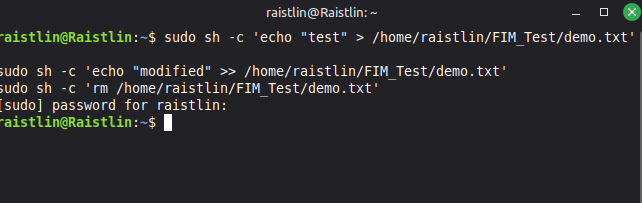

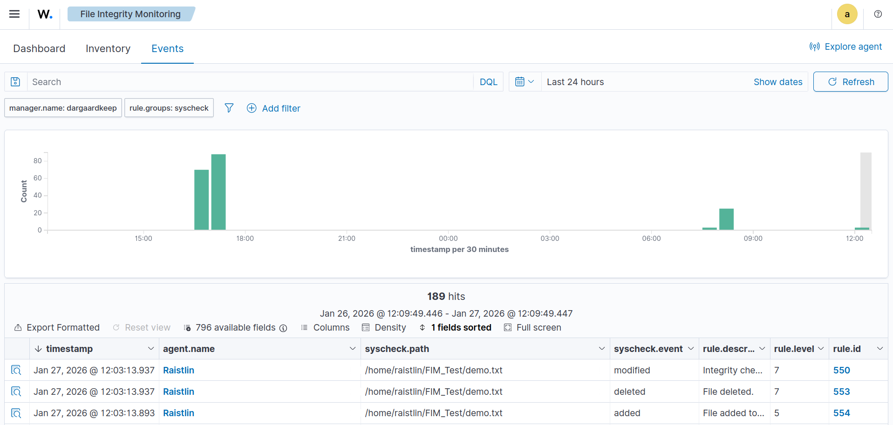

**Rules:** 550 / 553 / 554

<details>
<summary><strong>Triage Workflow</strong></summary>

Confirm file path

Validate user

Check lifecycle

Correlate with other activity

</details>

<details>
<summary><strong>Troubleshooting‑Driven Reproducibility</strong></summary>

Symptoms

No Linux FIM alerts

Missing Syscheck activity

XML errors

Root Causes

Missing Syscheck paths

Inotify issues

Agent connectivity problems

Fix Implemented

```xml
<syscheck>
  <directories check_all="yes">/etc</directories>
  <directories check_all="yes">/usr/bin</directories>
</syscheck>
```

Validation

Add → modify → delete

Rules 550/553/554 fired

</details>

---

## Privilege Escalation Scenarios (Linux & Windows)

### Linux SSH Privilege Escalation (Raistlin)


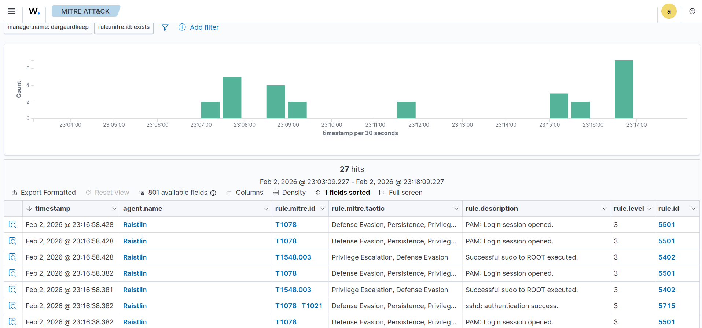

[SSH_Priv_Esc.csv](screenshots/SSH%20_Priv_Esc.csv)

<details>
<summary><strong>Triage Workflow</strong></summary>

Confirm SSH login

Validate sudo activity

Identify user → root transition

Check for privileged commands

Escalate if unexpected

</details>

<details>
<summary><strong>Troubleshooting‑Driven Reproducibility</strong></summary>

Symptoms

No sudo alerts

No PrivEsc correlation

Missing auth.log  entries

Root Causes

auditd not logging

auth.log  ingestion missing

Syscheck paths incomplete

Fix Implemented

```xml
<syscheck>
  <directories check_all="yes">/etc</directories>
  <directories check_all="yes">/usr/bin</directories>
</syscheck>
```

Validation

SSH → sudo → root

PrivEsc alerts fired

</details>

---

### Windows WinRM Privilege Escalation (Fistandantilus)


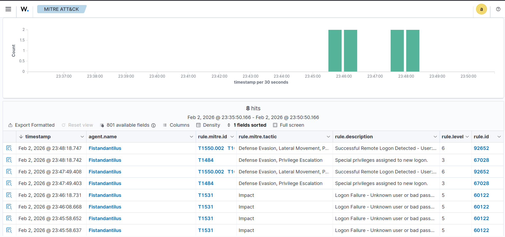

[Evil-WinRM.csv](screenshots/Evil-WinRM.csv)

<details>
<summary><strong>Triage Workflow</strong></summary>

Confirm remote NTLM logon

Validate PowerShell execution

Identify PrivEsc attempts (UAC, tasks, services)

Check for persistence artifacts

Escalate if malicious

</details>

<details>
<summary><strong>Troubleshooting‑Driven Reproducibility</strong></summary>

Symptoms

No Sysmon logs

No WinRM alerts

Missing registry FIM events

Root Causes

Sysmon misconfigured

EventChannel ACL issues

Registry XML malformed

Fix Implemented

```xml
<localfile>
  <location>Microsoft-Windows-Sysmon/Operational</location>
  <log_format>eventchannel</log_format>
</localfile>
```
Validation

WinRM → PowerShell → PrivEsc

Alerts fired

</details>

---

## Why This Lab Matters

This homelab demonstrates the ability to:

- Deploy and manage a SIEM/XDR platform  
- Simulate realistic attacks  
- Detect & triage alerts  
- Map detections to MITRE ATT&CK  
- Troubleshoot ingestion, configuration, and latency issues  

**Last updated:** February 2026
